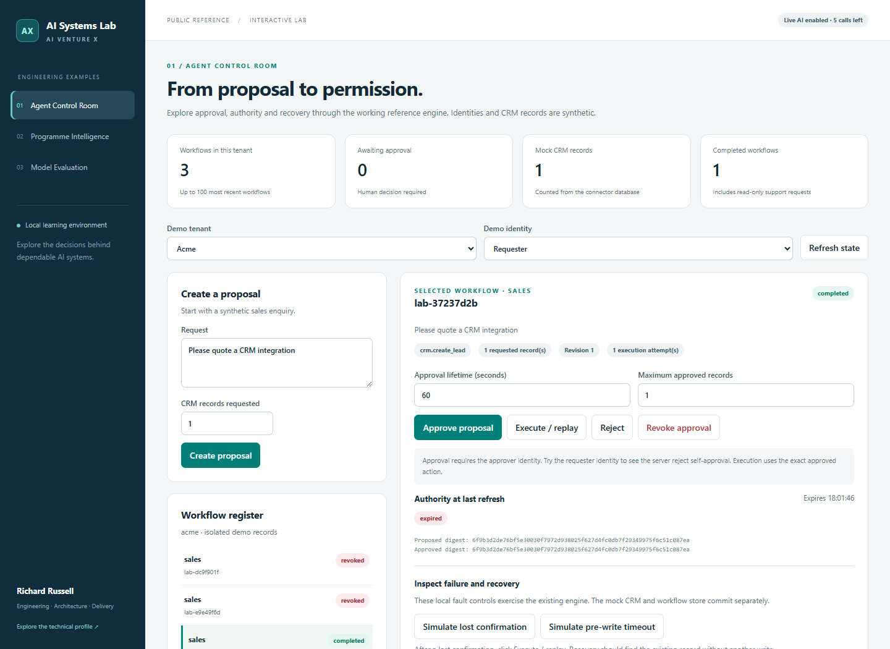

# Agent Control Room

A browser interface to the existing governed workflow: the same engine, approval checks and mock CRM used by the command-line demonstrations.

*Local example with synthetic data. The displayed record count comes from the mock CRM.*

## Run

From the repository root, run `python examples/run.py`, then open **http://127.0.0.1:8877/agent-control-room/**. No API key is needed. See the [lab runbook](../README.md) for data persistence and port options.

## Try a complete recovery

1. Keep **Acme / Requester** selected and click **Create proposal**.
2. Click **Execute / replay**. Expect HTTP 403 and no CRM record.
3. Click **Approve proposal** as requester. Expect HTTP 403 `approver_required`.
4. Switch **Demo identity** to **Approver**, inspect the proposed action and approve it. The default approval lasts 60 seconds; increase the lifetime if you want more time.
5. Switch back to **Requester** and click **Simulate lost confirmation**. The CRM count increases, but the workflow has not yet confirmed completion.
6. Click **Execute / replay**, then click it again. The workflow completes, the trace contains `reconciled`, and the record count stays unchanged.

Other fresh requests let you test expiry, revocation, rejection, pre-write timeouts and action-count limits. Revising an unstarted proposal clears approval. Switch to **Beta** to see a separate workflow register. **Download workflow** exports the current state and event trace.

The listed workflow count covers the most recent 100 requests in the selected tenant. The CRM count includes all records in that tenant's selected data directory.

## What this proves

The interface exposes real state transitions and side effects in the local reference. It demonstrates specific permission and recovery behaviours with mock identities and integrations. The local fault controls use the engine's existing Python test hooks; the original reference HTTP contract is unchanged.

Revocation cannot undo a committed effect. Recovery can reconcile an already-created record after authority expires or is revoked; that grants no permission for another write.

[Run all lab checks](../README.md#check-it-works) · [Inspect the engine](../../reference/workflow.py) · [Browser code](app.js)
