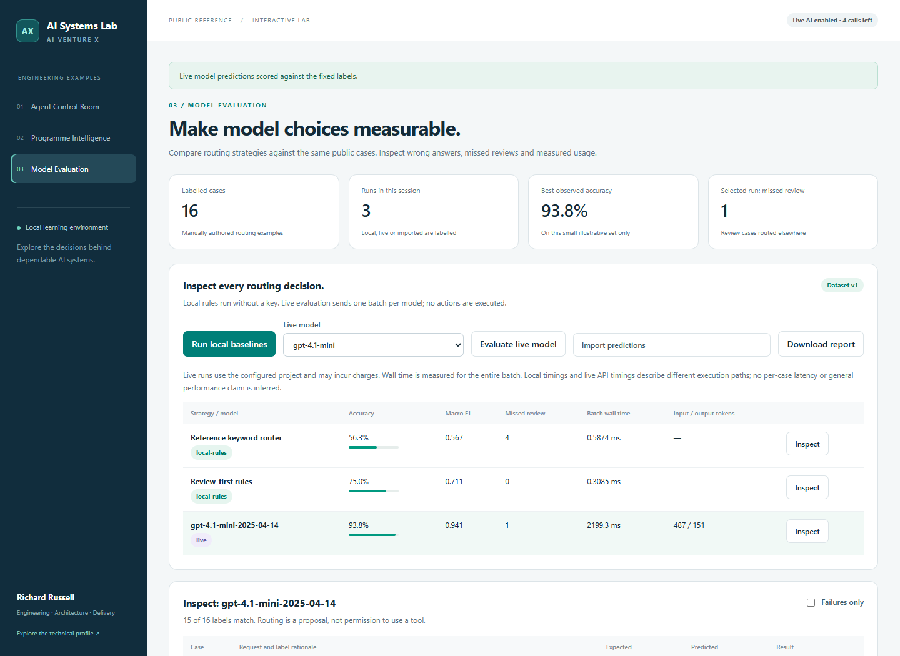

# Model Evaluation

Compare routing strategies on the same labelled requests, inspect failures and export the evidence.

*Captured from a local test on 16 synthetic public cases. These are individual observed runs, not general performance claims; your results and timings may differ.*

## Run

From the repository root, run `python examples/run.py`, then open **http://127.0.0.1:8877/model-evaluation/**.

The page executes two local rule-based strategies. These are real calculations and are labelled **local-rules**, not model calls. The reference keyword router scores **9/16** and review-first rules **12/16** on this deliberately small teaching set.

## Explore the evidence

- **Inspect** a run to compare its predicted labels with the expected labels and their rationales.
- Select **Failures only** to see mismatches.
- Compare accuracy, macro F1 and missed human-review cases.
- Read the confusion matrix: rows are expected labels; columns are predictions.
- **Download report** retains all current runs.

Macro F1 is the unweighted mean of F1 for sales, support and review. A class with no denominator receives zero. A missed review is a case labelled `review` but predicted as sales or support. A routing label never grants tool authority.

## Live models

With [live mode enabled](../README.md#optional-live-ai), select a model and click **Evaluate live model**. One request classifies the entire case batch. Only the routing policy, case IDs and messages are sent; expected labels and rationales stay with the evaluator.

The returned model identifier, complete-batch wall time and token usage are shown. Local rule timings and live network/API timings measure different execution paths. These single-batch runs do not measure throughput, per-request percentiles, sustained load or monetary cost.

## Import another model's predictions

**Download prediction template** provides the exact current dataset hash, a name and one prediction per case. Replace the example predictions with your actual results and upload the JSON using **Import predictions**. The template initially contains the first local baseline's outputs; downloading it does not evaluate another model.

The evaluator rejects a wrong dataset hash, missing/duplicate IDs and invalid labels. Imports are labelled **imported**, with no invented timings or provider usage. The file does not independently verify model provenance.

The [public dataset](cases.json) is small, manually labelled and can be overfit. It is suitable for demonstrating evaluation mechanics, not choosing a production model without a separate representative test set. Comparisons are held in the browser session until exported.

[Scoring implementation](../evaluation.py) · [Browser code](app.js) · [Run the checks](../README.md#check-it-works)
