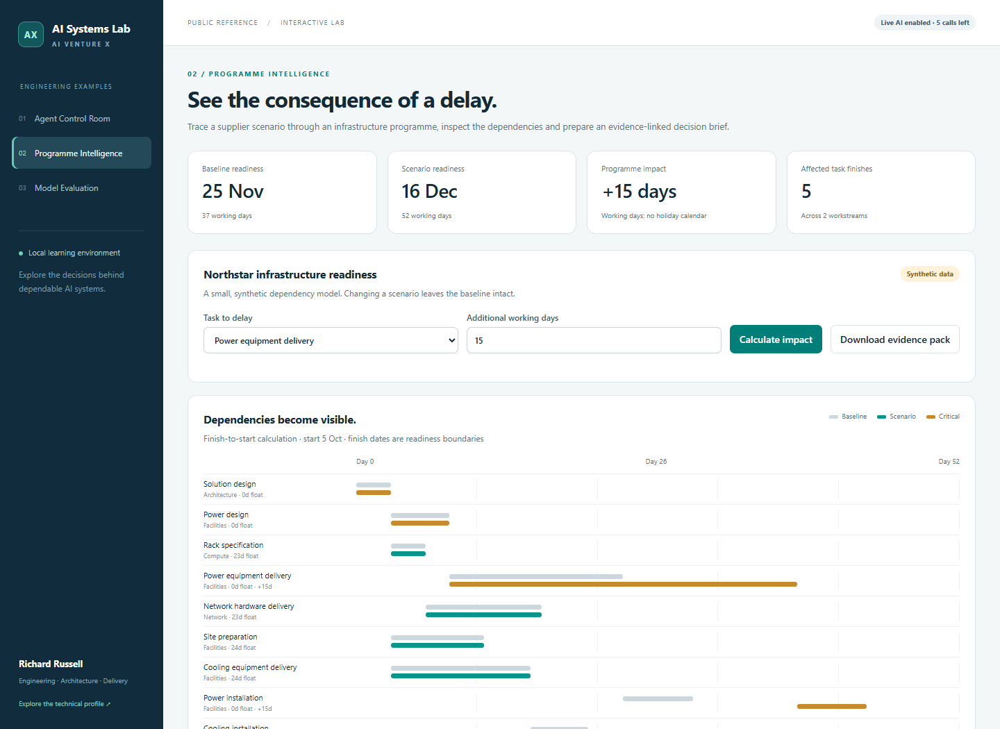

# Programme Intelligence

A small infrastructure delivery scenario connecting dependency analysis, explicit assumptions and source-linked AI commentary.

*Synthetic teaching programme. These durations are not estimates for a real facility.*

## Run

From the repository root, run `python examples/run.py`, then open **http://127.0.0.1:8877/programme-intelligence/**.

## Try the scenario

- The initial plan contains 15 tasks across Architecture, Facilities, Compute, Network and Assurance.
- Baseline readiness is **37 working days**, at the **25 November 2026** readiness boundary.
- Extending **Power equipment delivery** by **15 working days** moves readiness to **52 working days / 16 December 2026**. Five task finish boundaries move.
- Set the delay to **0** and recalculate: readiness returns to the baseline.
- Delay **Network hardware delivery** by **2 days**: available float absorbs it without changing overall readiness.

Inspect the baseline/scenario bars, critical tasks, task owners and dependency data. The calculated brief links to an evidence register. **Download evidence pack** retains the calculation, assumptions and any generated commentary.

## Calculation and AI responsibilities

The [Python calculation](../programme.py) validates a directed acyclic graph, performs forward/backward scheduling passes and derives total float. Dependencies are finish-to-start with no lag. Working days are Monday to Friday; finish dates identify when a successor may start. The original baseline stays unchanged.

The deterministic brief works without a key. With [live mode enabled](../README.md#optional-live-ai), **Generate AI commentary** sends the synthetic scenario and calculated evidence to OpenAI. Structured output and local validation require recognised source IDs. AI commentary is labelled separately and is cleared when you recalculate the scenario.

Citation membership is not factual entailment. Review the commentary against the visible sources and calculated task data. The model cannot change dates, approve a baseline or contact suppliers.

This example excludes resource levelling, holidays, costs, probabilistic forecasts and real construction engineering constraints.

[Sample programme](programme.json) · [Browser code](app.js) · [Run the checks](../README.md#check-it-works)
