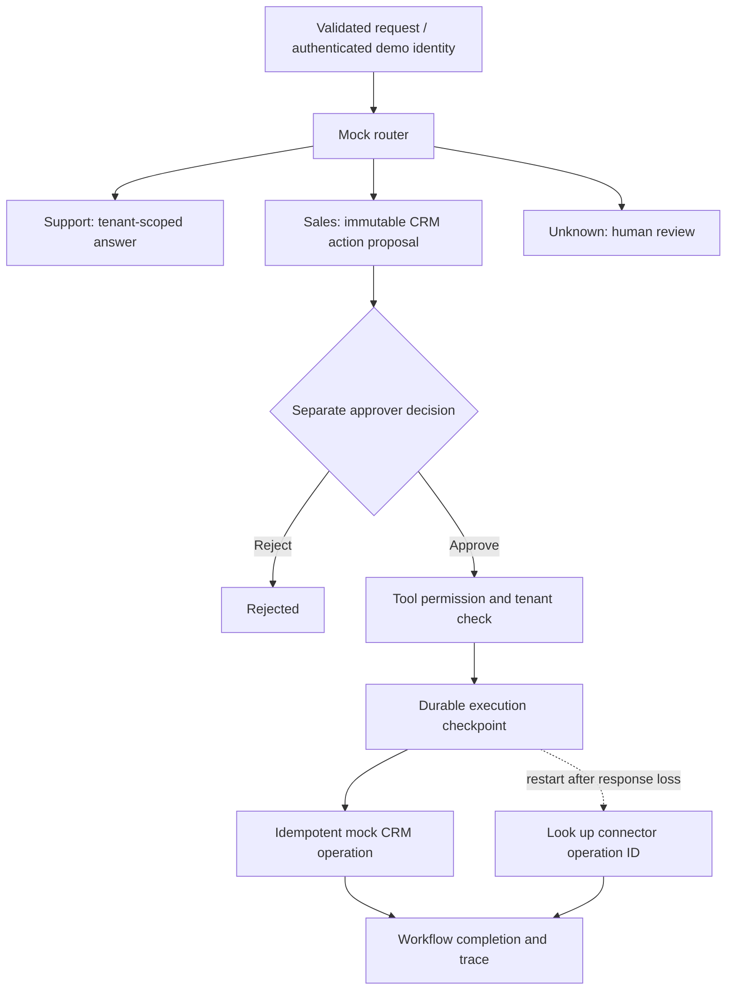

# Runnable governed workflow

A dependency-free Python 3.12+ reference connecting the four public project areas:

| Project | Demonstrated here |
|---|---|
| Enterprise Agentic AI | Tenant-scoped retrieval, governed tools, durable workflow records |
| Multi-Agent Orchestration | Deterministic routing to sales/support handlers, review fallback, recovery |
| AI Agent Organisation | Requester/approver separation, immutable action scope, approval and rejection |
| White-Label AI API | Validated JSON interface, status/error responses, replay-safe request IDs |

This is an executable control-flow reference. Routing and specialist responses are deterministic mocks, not live LLM agents. No provider calls, real CRM connections or paid services are used. The public demo identities are fixtures anyone can use; they do not authenticate real people.

## Run from the repository root

```powershell
python -m unittest discover -s tests -v
python -m reference.evaluate
python -m reference.demo --data .reference-data/demo
python -m reference.server --data .reference-data/api
```

The demo commits one mock CRM record, deliberately loses its response, closes the engine, reopens the databases and reconciles the completed action. Re-running it does not duplicate that record. The HTTP server binds only to `127.0.0.1:8765`; stop it with Ctrl+C.

## HTTP example (second PowerShell terminal)

```powershell
$requester = @{Authorization = 'Bearer demo-acme'}
$approver = @{Authorization = 'Bearer demo-acme-approver'}
$body = @{requestId = 'lead-001'; message = 'Please quote a CRM integration'} | ConvertTo-Json
Invoke-RestMethod http://127.0.0.1:8765/v1/workflows -Method Post -Headers $requester -ContentType application/json -Body $body
Invoke-RestMethod http://127.0.0.1:8765/v1/workflows/lead-001/decision -Method Post -Headers $approver -ContentType application/json -Body '{"decision":"approve"}'
Invoke-RestMethod http://127.0.0.1:8765/v1/workflows/lead-001/execute -Method Post -Headers $requester -ContentType application/json -Body '{}'
Invoke-RestMethod http://127.0.0.1:8765/v1/workflows/lead-001 -Headers $requester
```

Use `demo-beta` and `demo-beta-approver` for a separate tenant. Attempting to read or approve an Acme request through Beta returns 404. Calling execute before approval returns 403. Unknown body fields, including client `tools`, `tenant`, `agentId` and `system`, are rejected. See [openapi.json](openapi.json).

This reference introduces `/v1/workflows`; it does not replace or implement every field in the repository's conceptual `/v1/chat` examples.

## Execution model



The API boundary is stateless; workflow and connector state are explicit and durable. Two separate SQLite databases deliberately model a non-atomic system boundary. A composite `(tenant, requestId)` connector key prevents duplicate mock writes. On recovery the engine queries that key before attempting another write. This is not a general exactly-once guarantee for arbitrary third-party APIs.

Requests with the same ID and message replay existing state. Reusing an ID for different input returns 409. Support has no CRM action. Sales actions require approval; their payload cannot change after submission. Cancellation is allowed before execution starts. Once an external outcome may be uncertain, reconciliation is required instead of claiming cancellation undid it.

Before-write timeouts can be retried three times; the next attempt routes to review. Fault injection is available only through Python test hooks. A real connector needs bounded timeouts, scheduled backoff, idempotency/reconciliation support and compensating actions where relevant.

## Evaluations and evidence

`cases.json` holds ten explicit scenarios: sales, support, ambiguous intent, attempted instruction-based bypass, approval, rejection, cancellation and response-loss recovery. The evaluator checks routing, terminal/pending state, execution authority, external record counts and trace presence. Unit/integration tests additionally exercise input validation, tenant isolation, request replay and retry exhaustion.

`evaluation-results.json` records a local sample run. Timings include local SQLite activity and are not service latency claims. Provider cost is zero because no model is called; infrastructure costs are excluded. The dataset is a smoke suite, not a statistically representative benchmark. A CI workflow runs both suites on pushes and pull requests once published.

## Scope and production extensions

- Single-worker local reference; no distributed leases or concurrent execution guarantee. SQLite serialises workflow mutations, but the two-system execution path needs a deliberate concurrency design before adding workers.
- Mock identities must be replaced by verified identity, credential lifecycle management and tenant-bound authorisation. Approver identities here represent roles, not individual people. Approval expiry, revocation and payload signatures are not implemented.
- Actions store synthetic enquiry text in local SQLite. There is no encryption-at-rest, retention policy or production PII processing. Traces omit enquiry content; workflow status exposes it only within the demo tenant boundary.
- The server uses Python's development HTTP server. It has no TLS, rate limiting, hardened request handling or production deployment configuration.
- Keyword routing is intentionally limited. There is no real multi-agent reasoning, retrieval index or semantic prompt-injection defence. Untrusted text cannot modify server permissions, but live models and tools need separate adversarial evaluations.
- The mock CRM enforces idempotency itself. A real connector must support an equivalent operation key or a documented reconciliation strategy.
- The `needs_review` state is a terminal handoff in this reference; no operator review UI or resume procedure is implemented.
- Add model/prompt/policy versions, cost budgets, evaluation gates and a simpler baseline comparison when connecting a model. Keep permission enforcement outside model judgement.

The source profile's scale and production claims are not established by this demo. This example demonstrates specific controls on synthetic data.
