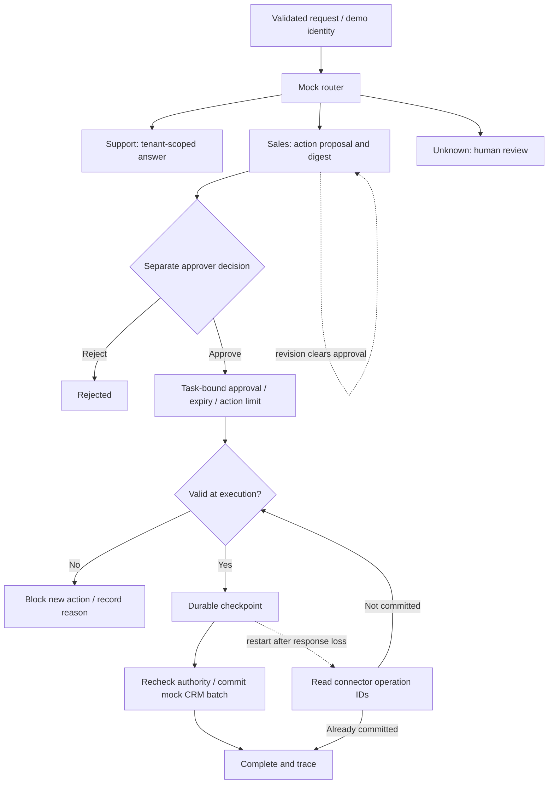

# Runnable governed workflow

A Python 3.12+ reference demonstrating how permission remains tied to a specific task and action. No third-party packages, API keys, live models or external CRM are required.

## Try it in under a minute

Run these commands in PowerShell, Terminal or a shell with Git and Python installed. On systems where Python is named `python3`, substitute that command.

```sh
git clone https://github.com/Poochaman/enterprise-agentic-ai.git
cd enterprise-agentic-ai
python -m reference.smoke
```

The smoke check starts a temporary local API, runs seven groups of HTTP checks and shuts it down. You should see `PASS` for approved execution, expiry, revocation, revised approvals, action limits, tenant isolation and the resulting CRM records. It uses a real one-second expiry and fresh temporary data each time, so you can run it repeatedly.

For the full tests, scenario report and a persistent recovery demo, run from the repository root:

```sh
python -m unittest discover -s tests -v
python -m reference.evaluate
python -m reference.demo --data .reference-data/demo
```

The recovery demo commits one mock CRM record, deliberately loses its response, closes the engine, reopens the databases and reconciles the completed action. Re-running it does not duplicate that record. The data directory remains available for inspection.

## What this demonstrates

| Project area | Demonstrated here |
|---|---|
| Enterprise Agentic AI | Tenant-scoped context, governed tools and durable workflow records |
| Multi-Agent Orchestration | Deterministic sales/support routing, review fallback and recovery |
| AI Agent Organisation | Separate requester/approver roles, expiring task authority and operator revocation |
| White-Label AI API | Validated JSON, explicit errors, versioned proposals and replay-safe request IDs |

This is an executable control-flow reference. Routing, specialist responses, identities and integrations are mocks. The public demo tokens represent roles; anyone can use them. They do not authenticate real people. Use synthetic enquiries only.

The example illustrates a subset of the principles discussed in Richard Russell's [The Consequence Machine](https://www.amazon.co.uk/Consequence-Machine-Richard-Russell/dp/B0HBR9Z3YC): capability is separate from authority, permissions are enforced outside model judgement, and recovery must be verified.

## Explore the HTTP API

Start the server from the repository root:

```sh
python -m reference.server --data .reference-data/api
```

It binds only to `127.0.0.1:8765`. Stop it with Ctrl+C. If that port is in use, pass `--port 8766` and change the URL below accordingly.

In a second PowerShell terminal:

```powershell
$api = 'http://127.0.0.1:8765/v1/workflows'
$requester = @{Authorization = 'Bearer demo-acme'}
$approver = @{Authorization = 'Bearer demo-acme-approver'}
$requestId = 'lead-' + [guid]::NewGuid().ToString('N')
$body = @{requestId = $requestId; message = 'Please quote a CRM integration'} | ConvertTo-Json
$proposal = Invoke-RestMethod $api -Method Post -Headers $requester -ContentType application/json -Body $body
$proposal.action | ConvertTo-Json

# Review the exact action above before approving its digest.
$decision = @{decision = 'approve'; actionDigest = $proposal.authority.actionDigest; ttlSeconds = 300; maxActions = 1} | ConvertTo-Json
Invoke-RestMethod "$api/$requestId/decision" -Method Post -Headers $approver -ContentType application/json -Body $decision
Invoke-RestMethod "$api/$requestId/execute" -Method Post -Headers $requester -ContentType application/json -Body '{}'
Invoke-RestMethod "$api/$requestId" -Headers $requester
```

Expected final state: `completed`, with one `leadId` and a trace. Execute the same request again to observe replay without a second record. A fresh request ID lets you repeat the whole walkthrough. Approvals last five minutes by default; if you pause past the deadline, execution returns `approval_expired`. If no execution attempt started, read the current proposal and approve it again before retrying.

## Try the authority controls

Each row describes a separate fresh sales task. The smoke check exercises these automatically; use the API to inspect them manually. Paths are relative to `/v1/workflows/{requestId}`.

| Experiment | Request | Expected effect |
|---|---|---|
| Execute without approval | POST `/execute`, `{}` | HTTP 403; no CRM record |
| Expire approval | Approve with `ttlSeconds: 1`, wait at least one second, then execute | HTTP 403 `approval_expired`; no new write |
| Revoke approval | As approver, POST `/revoke`, `{}`, then execute | HTTP 403 `approval_revoked`; no new write |
| Change an approved proposal | As requester, POST `/revise`, `{"message":"Revised CRM enquiry","revision":1}` | Revision increments; previous approval is cleared |
| Approve an old proposal | Submit the previous `actionDigest` after a revision | HTTP 409 `stale_action_digest` |
| Exceed an action limit | Submit `leadCount: 2`, approve with `maxActions: 1`, then execute | HTTP 403 `action_limit_exceeded`; the whole batch is blocked |
| Approve the batch | Approve that blocked proposal with `maxActions: 2`, then execute | Two mock lead records; replay adds none |
| Cross tenant boundary | Read or approve an Acme request with a Beta token | HTTP 404 |

`leadCount` creates repeated synthetic lead records solely to demonstrate an action-count budget. It is not lead discovery or contact enrichment. It is accepted only for sales tasks, from 1 to 5. The approver can permit 1 to 3 actions per task; requests for more than 3 cannot execute. This is a per-task cap, not a tenant-wide quota or a monetary budget.

Approval lifetimes are 1–900 seconds. The caller cannot change server time through the API. An approval binds the exact action digest, tenant, deadline and action limit. Revising is permitted only before execution starts and requires the current revision number. The original submission remains the idempotency identity: replaying it returns current state; changing its initial payload still returns 409.

Revocation is final for that workflow. It prevents further writes; it does not undo completed effects. If a connector write already committed before its response was lost, an execute request may **reconcile that existing result** even after revocation or expiry. The authority remains revoked/expired in the response; reconciliation grants no new permission and creates no record.

## Execution and recovery



The API boundary is stateless; workflow and connector state are explicit. Two separate SQLite databases model a non-atomic system boundary. Tenant-scoped operation keys prevent duplicate mock writes. Multi-lead mock batches commit atomically inside the mock CRM; general third-party APIs may not support that guarantee.

The engine checks authority before its durable checkpoint and again immediately before the connector write. A local workflow database lock orders changes to authority against that write. Revocation takes effect when its operation is processed; it cannot recall a write already committed or interrupt an in-flight external call. This is a single-worker teaching example, not a distributed kill switch.

Before-write timeouts can be retried up to three attempts. The next call routes to `needs_review` if authority remains valid. Cancellation is allowed before execution starts; it does not pretend to undo an uncertain external result. Fault injection and deterministic clocks are Python-only test hooks.

See [openapi.json](openapi.json) for the contract. This reference uses `/v1/workflows`; it does not replace the repository's conceptual `/v1/chat` examples. Version 0.2 requires `actionDigest` when approving; the walkthrough above shows the updated request.

## Evaluations and compatibility

- Thirty unit/integration tests cover authorisation, expiry boundaries, edits, revocation, limits, tenant isolation, retry and migration behaviour.
- [cases.json](cases.json) contains eighteen scenarios with explicit expected states and side effects. The evaluator uses an injected clock for fast, repeatable expiry checks.
- `python -m reference.smoke` launches the actual server process and validates its HTTP interface with the real clock.
- [evaluation-results.json](evaluation-results.json) records a sample local run. Timings are local SQLite timings, not service performance claims. Provider cost is zero because no model is called; infrastructure and engineering costs are excluded.
- GitHub Actions runs tests, evaluations, the repeatable recovery demo and HTTP smoke checks on Windows and Linux with Python 3.12.

Existing demo databases are migrated without deleting records. Completed workflows remain readable. Old approvals without a digest and expiry are invalidated. Unstarted actions require fresh approval; uncertain old writes can be reconciled by operation ID. Do not delete a data directory to fix an uncertain external action.

## Production scope

Real deployments still need verified identities, protected credentials, named approvers, durable audit custody, time synchronisation, distributed execution coordination, connector timeouts, backoff, partial-failure handling and resource limits across tasks. The action digest is a consistency check, not a cryptographic signature or protection against an administrator changing the database.

This demo has no live LLM, vector index, semantic prompt-injection defence, UI, TLS, rate limiting, production hosting or encryption-at-rest. `needs_review` is a terminal handoff with no review UI. Its tests demonstrate specific controls on synthetic data; they do not establish production scale, model quality or the book's wider conclusions.
